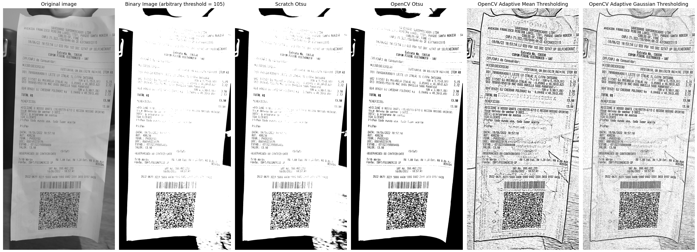
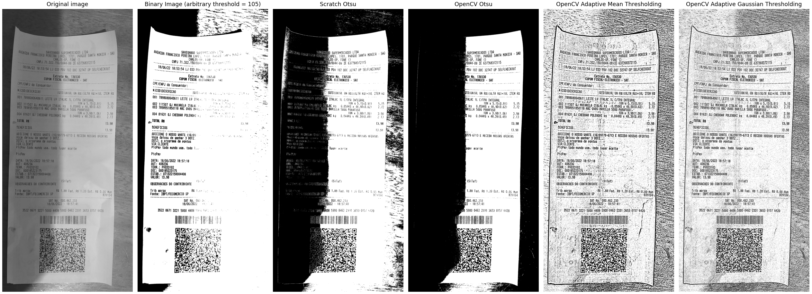
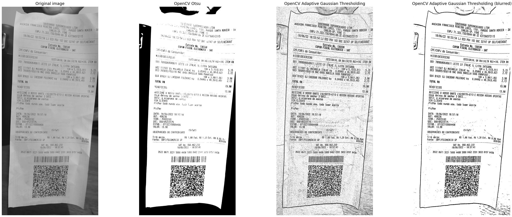

# Report

## Summary

- [Goal](#goal)
- [Input Images](#input-images)
- [Initial Development](#initial-development)
- [Next Steps](#next-steps)

##  Goal

The project's main goal is to provide convenient and fast means for someone to split grocery purchases between a group of people. Basically a [Splitwise](http://www.splitwise.com/)-like software that extracts the products' data from the grocery receipts' photos and works in batch.

##  Input Images

All of the input images are [grocery receipt photos](../receipts) taken by the students in this group. Based on the professor's feedback, we initially intend to work with simple and clean images (with no shadow or distortions) in order to segment the background and highlighting the text.

### Without shadow

### With shadow

##  Initial Development

Our first action was to try and apply different methods of image segmentation and compare results, based on which we'll be able to determine what kinds of image enchanement and/or restoration are necessary to make the photos more readable.

We initially tried using a static thresholding/binarization method with an arbitrary threshold of `105` but soon resorted to trying adaptive methods. We then tried applying the Otsu Thresholding method provided in class (implemented from scratch), but but had some unexpected errors with it, as well as a not so great binary image in which the receipt's data isn't readable.

The next step was to add OpenCV as a dependency and try some of it's methods:

1. Otsu Thresholding (Global)
2. Adaptive Mean Thresholding (Regional)
3. Adaptive Gaussian Thresholding (Regional)

These methods outputted the best results, specially Otsu and Adaptive Gaussian, so we'll focus the development on them.

We also tried comparing the results between photos with a shadow over the receipt and some without it and found that while the Adaptive Gaussian Thresholding provided very similar results (very readable image) for both types of photos, the Otsu Thresholding got the best result for the photo with the evenly lit receipt, but in the other one it incorrectly blacked out the darker section of the receipt. The comparison can be seen in the [input images section](#input-images).

In order to make the Adaptive Gaussian Thresholding resulting image cleaner, we applied a median blur. This greatly improved the image and subsequent OCR output, as can be seen below and in [docs/OCR_TESTS.md](./OCR_TESTS.md) - the outputs in this document are still rudimentary and are expected to get better once we improve the image pre-processing.

##  Next Steps

- Apply an edge-detection algorithm in order to cut the whole receipt out of the picture before applying the binarization;
- Apply some sort of image enhancement filter (either contrast or brightness manipulation) in order to decrease the shadow's impact on the image;
    - This could possibly make the Otsu Thresholding satisfactory for the shadowy photo;
- Test more with removing noise and contours before applying OCR;
- Testing out different settings for Tesserect's OCR.

## References

- SCC0251's class presentations as well as [Jupyter Notebooks](https://github.com/maponti/imageprocessing_course_icmc);
- OpenCV - [Image Thresholding](https://opencv24-python-tutorials.readthedocs.io/en/latest/py_tutorials/py_imgproc/py_thresholding/py_thresholding.html);
- StackOverflow - [Remove background text and noise from an image using image processing with OpenCV](https://stackoverflow.com/questions/60145306/remove-background-text-and-noise-from-an-image-using-image-processing-with-openc#60404579);
- StackOverflow - [Implementing Otsu binarization from scratch python](https://stackoverflow.com/questions/48213278/implementing-otsu-binarization-from-scratch-python);
- StackOverflow - [Converting an image to grayscale using numpy](https://stackoverflow.com/questions/51285593/converting-an-image-to-grayscale-using-numpy).
- [StackOverflow - Increase image brightness without overflow](https://stackoverflow.com/questions/44047819/increase-image-brightness-without-overflow/44054699#44054699)
- [Using Tesseract OCR with Python](https://pyimagesearch.com/2017/07/10/using-tesseract-ocr-python/)
- [How to OCR with Tesseract, OpenCV and Python](https://nanonets.com/blog/ocr-with-tesseract/#introduction)
