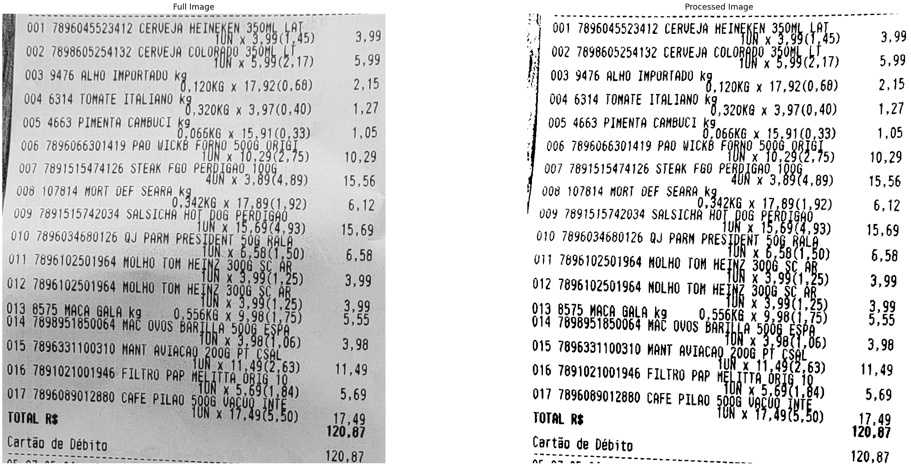
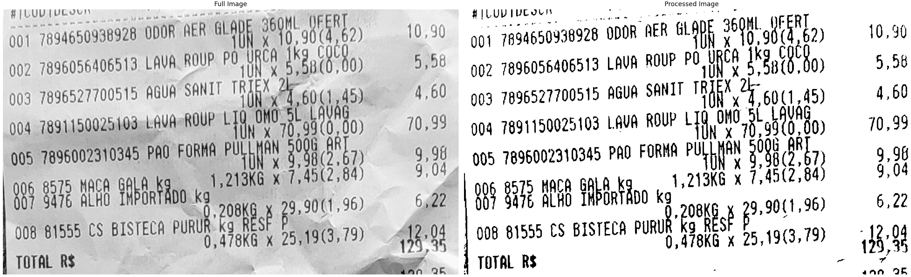
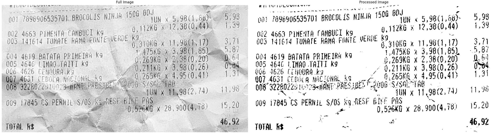
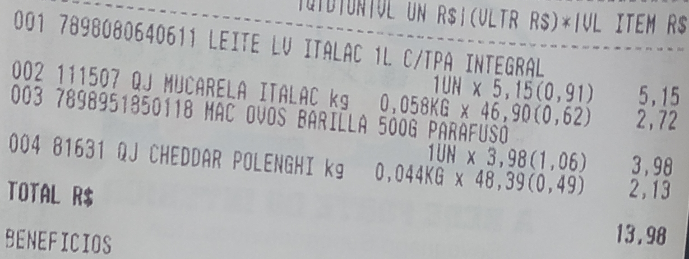
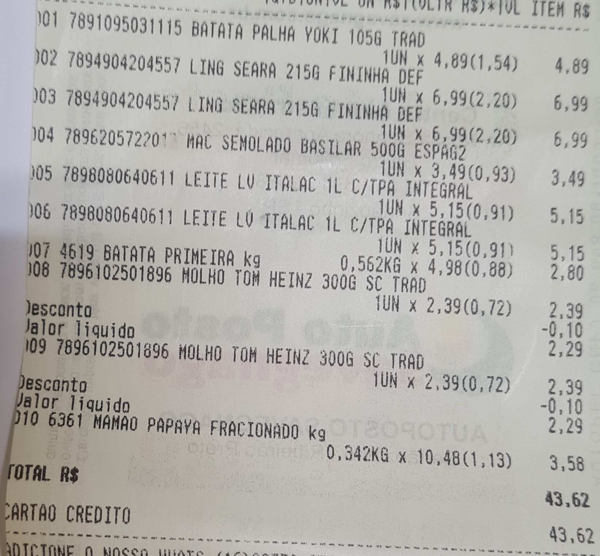
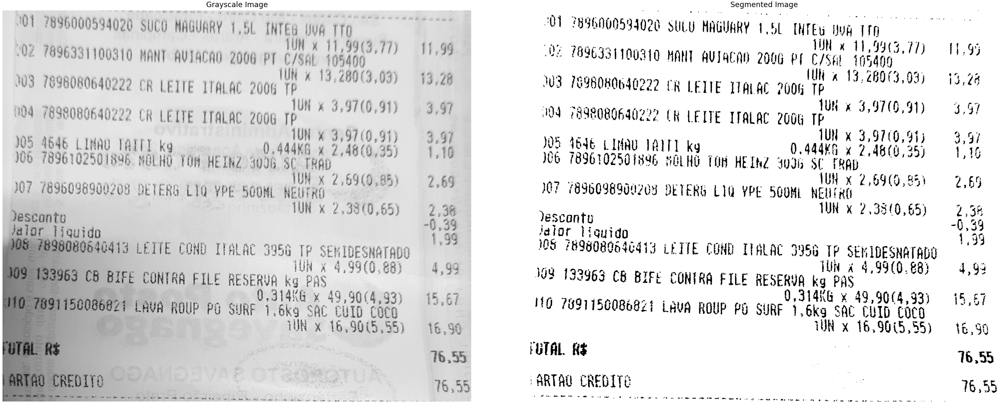
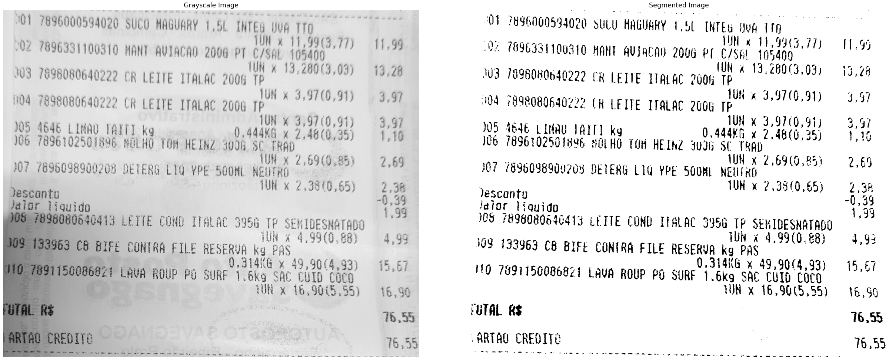
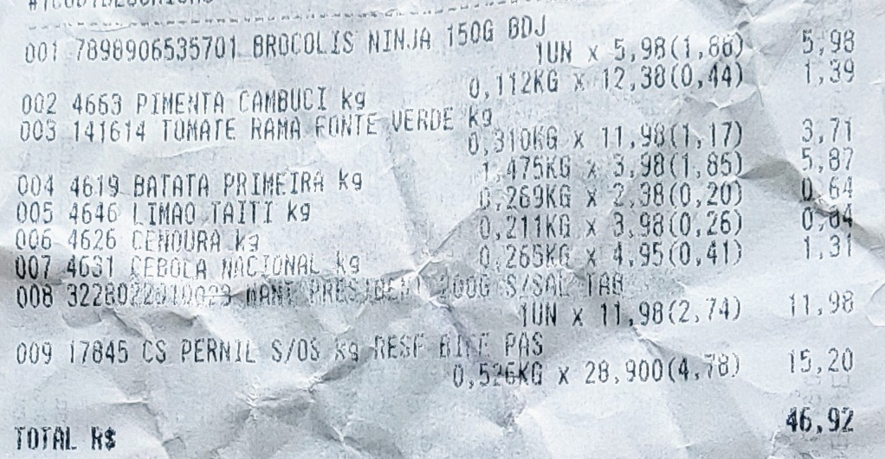

# Report

## Summary

- [Goal](#goal)
- [Input Images](#input-images)
- [Group](#goal)
- [Initial Development](#initial-development)
    * [Previously Intended Next Steps](#intended-next-steps)
- [What We Actually Did Next](#next-steps)
    * [Image Processing Pipeline](#pipeline)
    * [Training Tesseract](#training)
    * [System Output](#output)
- [Results](#results)
- [Conclusion](#references)
- [References](#references)

## <a id="goal"></a> Goal

The project's main goal is to provide convenient and fast means for someone to split grocery purchases between a group of people. Basically a [Splitwise](http://www.splitwise.com/)-like software that extracts the products' data from the grocery receipts' photos and works in batch.

## <a id="input-images"></a> Input Images

All of the input images are [grocery receipt photos](../receipts) taken by the students in this group. Based on the professor's feedback, we initially intend to work with simple and clean images (with no shadow or distortions) in order to segment the background and highlighting the text.

### Without shadow


### With shadow


## <a id="group"></a> Group

We mostly worked together as a group either synchronously in Discord (when coding, who needs pair programming when you have *quartet programming*) or asynchronously via Telegram (sharing research and debating what to do/try next and what steps to take). But the main individual contributions of each member were:

- Abner Ignacio Melin Leite
    * Managing (taking and cropping the photos) the input images
    * Research about Tesseract, how to train it and other OCR options
    * Managing the data (selecting, cropping, describing/transcribing) for training Tesseract
- Antônio Pedro Medrado
    * Research about the image processing pipeline
    * Writing the report
    * Preparing the presentation slides
    * Preparing the demo notebook
- Lucas Henrique Sant'Anna
    * Managing (taking and cropping the photos) the input images
    * Writing the presentation script
    * Editing the presentation video
    * Preparing the demo notebook
- Lucas Viana Vilela
    * Code implementation
    * Research about the image processing pipeline and OCR techniques
    * Writing the report

## <a id="initial-development"></a> Initial Development

Our first action was to try and apply different methods of image segmentation and compare results, based on which we'll be able to determine what kinds of image enchanement and/or restoration are necessary to make the photos more readable.

We initially tried using a static thresholding/binarization method with an arbitrary threshold of `105` but soon resorted to trying adaptive methods. We then tried applying the Otsu Thresholding method provided in class (implemented from scratch), but but had some unexpected errors with it, as well as a not so great binary image in which the receipt's data isn't readable.

The next step was to add OpenCV as a dependency and try some of it's methods:

1. Otsu Thresholding (Global)
2. Adaptive Mean Thresholding (Regional)
3. Adaptive Gaussian Thresholding (Regional)

These methods outputted the best results, specially Otsu and Adaptive Gaussian, so we'll focus the development on them.

We also tried comparing the results between photos with a shadow over the receipt and some without it and found that while the Adaptive Gaussian Thresholding provided very similar results (very readable image) for both types of photos, the Otsu Thresholding got the best result for the photo with the evenly lit receipt, but in the other one it incorrectly blacked out the darker section of the receipt. The comparison can be seen in the [input images section](#input-images).

In order to make the Adaptive Gaussian Thresholding resulting image cleaner, we applied a median blur. This greatly improved the image and subsequent OCR output, as can be seen below and in [docs/OCR_TESTS.md](./OCR_TESTS.md) - the outputs in this document are still rudimentary and are expected to get better once we improve the image pre-processing.


### <a id="intended-next-steps"></a> Previously Intended Next Steps

- Apply an edge-detection algorithm in order to cut the whole receipt out of the picture before applying the binarization;
- Apply some sort of image enhancement filter (either contrast or brightness manipulation) in order to decrease the shadow's impact on the image;
    - This could possibly make the Otsu Thresholding satisfactory for the shadowy photo;
- Test more with removing noise and contours before applying OCR;
- Testing out different settings for Tesserect's OCR.

## <a id="next-steps"></a> What We Actually Did Next

After the project's partial submission we received feedback from both the professor and the teaching assistant. Based on that feedback, the main change we decided to make to the project's proposal was to receive as input only the targeted area from the grocery receipt's photo, instead of the full image.

What this means is that now, instead of using the full image as input, we'll use a cropped version of it, as can be seen below. This provided great improvement in OCR results.


### <a id="pipeline"></a> Image Processing Pipeline

We tried the previously intended next steps, specifically the ideas about improving the image processing and segmentation, but they didn't amount to much. After more research, we ended up adopted the idea to use mathematical morphology and image subtraction (in addition to Otsu's thresholding) to produce a cleaner segmented image.

That gave great results and now our pipeline looks like this:

- Read the image and convert it to grayscale
- Apply morphological dilation and a median blur to the image
    * By dilating the background this results in removing the text (foreground) from the image, leaving only the receipt paper and the rest of the background (including noise and shadows)
- Subtract the background image from the original one, leaving only in the foreground
- Inverting the foreground image
- Normalize + truncate + normalize the foreground image
    * We arrived at this step empirically
- Apply Otsu's Thresholding to the normalized image
- Apply morphological opening to the segmented image in order to close gaps in the text

With this, we got great results even for the shadowy photo (below).


#### Other Processed Image Examples

As you can see, the cleaner/less crumpled the receipt, the better. The original images are on the left (converted to grayscale) and the segmented one is on the right.





### <a id="training"></a> Training and Configuring Tesseract

#### Tesseract x Google Vision

Both the professor and the teaching assistant mentioned they tried uploading our pre-processed image to the [Google Vision API online demo](https://cloud.google.com/vision/#section-2) and got better OCR results than we presented, and that maybe there was a way to configure Tesserect to work like that.

After some research, we found out that even though Tesseract is in fact sponsored by Google, Google's Vision AI is a paid API (apart from the online demo) and that those are two different products. Tesseract is a free (and lighter) alternative to Vision AI, but usually does not produce as good results - although training it and configuring it's OEM[^1] and PSM[^2] properly can certainly help improve it.

#### Configuration

Tessseract's manpage states that it's PSMs[^2] are:

```
0 = Orientation and script detection (OSD) only.
1 = Automatic page segmentation with OSD.
2 = Automatic page segmentation, but no OSD, or OCR. (not implemented)
3 = Fully automatic page segmentation, but no OSD. (Default)
4 = Assume a single column of text of variable sizes.
5 = Assume a single uniform block of vertically aligned text.
6 = Assume a single uniform block of text.
7 = Treat the image as a single text line.
8 = Treat the image as a single word.
9 = Treat the image as a single word in a circle.
10 = Treat the image as a single character.
11 = Sparse text. Find as much text as possible in no particular order.
12 = Sparse text with OSD.
13 = Raw line. Treat the image as a single text line,
    bypassing hacks that are Tesseract-specific.
```

Considering the receipt images consist of many lines of text, we focused text in modes 1 and 3 - with automatic page segmentation and without/with OSD[^3], respectively. Results were exactly the same - even for tilted images (in which you'd expect OSD would perform better) both were as bad. We kept the PSM[^2] setting to mode **1**.

Then there's OEM[^1]:

```
0 = Original Tesseract only.
1 = Neural nets LSTM only.
2 = Tesseract + LSTM.
3 = Default, based on what is available.
```

We set this to mode **1** since it's the only one our training data (better described below) supports.

#### Training

To train a Tesseract model we decided to use [Tesstrain](https://github.com/tesseract-ocr/tesstrain), which provided  us with a high level Makefile-powered CLI interface to apply our data to Tesseract and output a trained model.

To feed Tesstrain, we gathered 28 lines of text from different receipts and transcribed them to text files (called "ground truth files"), as you can see in the [ocr-training](../ocr-training) directory. The training output was the file [grocery.traineddata](../ocr-training/grocery.traineddata), that we're now using (and this means you need to copy it to your `tessdata` directory in order to run the project).

Here's an example of training image and ground truth:


```
001 7898080640611 LEITE LV ITALAC 1L. C/TPA INTEGRAL 1UN x 5,15(0,91) 5,15
```

Aside from this, we're also using the portuguese and english languages tessdata files, which you can get from [tesseract-ocr/tessdata_best](https://github.com/tesseract-ocr/tessdata_best) and also need to be in your `tessdata` directory.

### <a id="output"></a> System Output

Also with the approval of the professor and teaching assistant, we did not focus on implementing an interactive system, but instead on the actual image processing pipeline. So this is why we pivoted from the original goal (where the user would be able to split any number of grocery receipts between a group of people, by selecting which products each person would pay for) for a simpler system which takes a single cropped grocery receipt photo as input and outputs it's relevant contents formatted and in string format.

We used RegEx to extract the relevant data from Tesseract's raw output (from which we also corrected some common text recognition errors that we noticed while testing). The extracted data consists in:

- Each product's name;
- Each product's quantity (units, kilograms, etc);
- Each product's "unity of measurement" (units, kilograms, etc);
- Each product's unitary price (per unit, kilogram, etc);
- Each product's total price (for the whole quantity bought);
- The receipt's total price.

To try and ascertain some degree of consistency between the data, we make three validation checks

1. For each product: is the extracted total price is equivalent (with a margin of error) to the product between quantity and unitary price?
2. For the whole receipt: if a total price could not be extracted, do all products have consistent pricing?
3. For the whole receipt: if a total price could be extracted, is it equivalent (with a margin of error) to the sum of the prices of each product?

If any of these questions is a negative, we add a "(maybe)" to the output of some data, to indicate there's no guarantee that info is correct.

<a id="input-output"></a>
#### Input



#### Output

```
Product #1
Product name: Mucarela Italac Kg
Quantity bought: 0.06 kg.
Price per kg.: R$46.9
Total price: R$2.72

Product #2
Product name: 1 Hrc Ovos Barilla 5006 Parafuso 3
Quantity bought: 1.0 un. (maybe)
Price per un.: R$3.98 (maybe)
Total price: R$98.0 (maybe)

Product #3
Product name: J Lheddar Polenghi Kg
Quantity bought: 20.04 kg. (maybe)
Price per kg.: R$18.39 (maybe)
Total price: R$2.51 (maybe)

TOTAL RECEIPT VALUE: R$13.98 (maybe)
```

## <a id="results"></a> Results

### Example 01

Here's an example using a more complex photo.

- Text partly wiped out in some sections;
- Leftmost part truncated;
- Application of some discounts;

#### Input



#### Output

```
Product #1
Product name: Ling Seara 2156 Inia. Def
Quantity bought: 1.0 un.
Price per un.: R$6.99
Total price: R$6.99

Product #2
Product name: 1 Ing Serra 2156 Fininha Def
Quantity bought: 1.0 un.
Price per un.: R$6.99
Total price: R$6.99

Product #3
Product name: Semolado Bastlar 500G Es
Quantity bought: 1.0 un.
Price per un.: R$3.49
Total price: R$3.49

Product #4
Product name: Leite Ly Italac 1L C/Tpr Tera
Quantity bought: 1.0 un.
Price per un.: R$5.15
Total price: R$5.15

Product #5
Product name: Leite Lv Italac 1L L/Tpa Integral
Quantity bought: 1.0 un.
Price per un.: R$5.15
Total price: R$5.15

Product #6
Product name: Molho Ton Heinz 3006 Sc Trad
Quantity bought: 1.0 un.
Price per un.: R$2.39
Total price: R$2.39

Product #7
Product name: Holho Tom Heinz 3006 5C Trad
Quantity bought: 1.0 un.
Price per un.: R$2.39
Total price: R$2.39

Product #8
Product name: Mahao Papaya Fracionadd Kg
Quantity bought: 0.34 kg. (maybe)
Price per kg.: R$10.48 (maybe)
Total price: R$5.15 (maybe)
```

### Example 02

Here's an example where the Tesseract's text recognition isn't good (probably because of too many gaps in the text) and as a result the system is only able to barely recognize two products.

#### Input



#### Output

```
Product #1
Product name: Iul X13,2603,04) Gy60Rog0222 Cr Leite Italac 2006 Tp  =  Aa Van ;
Quantity bought: 1.0 un.
Price per un.: R$3.97
Total price: R$3.97

Product #2
Product name: (Kr Leite Italac 20Gg Tf  En
Quantity bought: 1.0 un. (maybe)
Price per un.: R$3.97 (maybe)
Total price: R$9.51 (maybe)

TOTAL RECEIPT VALUE: R$13.48 (maybe)
```

#### Observation

In this specific example, applying a stronger morphological opening would produce better results by closing the gaps in the text. The problem is that without some kind of automatic recognition of which images need this stronger opening it would also make other images with fewer gaps less readable.



```
Product #1
Product name: Um X 11,991(3,77) É 7696331100310 Man Aviacan 200G Pt A 105400
Quantity bought: 1.0 un.
Price per un.: R$13.28
Total price: R$13.28

Product #2
Product name: (K Leite Italac 2G0G Tf
Quantity bought: 1.0 un. (maybe)
Price per un.: R$3.97 (maybe)
Total price: R$9.85 (maybe)

Product #3
Product name: Deterg L1 Ype 500Ml Ned Id I |
Quantity bought: 1.0 un.
Price per un.: R$7.35
Total price: R$7.35
```

### Example 03

For a very crumpled paper, most items aren't detected and the price recognition fails miserably.

#### Input



#### Output

```
Product #1
Product name: Batata Primeira Ka 1,475X6 4 3,7001002 Oo Guima Moro
Quantity bought: 5263.0 kg.
Price per kg.: R$2.38
Total price: R$12525.94

Product #2
Product name: Pernil $705 Ka Esf Bee Pas E Uo,
Quantity bought: 546.0 kg.
Price per kg.: R$28.0
Total price: R$15288.0

TOTAL RECEIPT VALUE: R$27813.94
```

## <a id="conclusion"></a> Conclusion

After a lot of research and trial and error, we arrived at an image processing pipeline consisting that uses filtering/blurring, mathematical morphology and image segmentation techniques in order to clean up a cropped grocery receipt photo and feed it to an OCR software.

The final system is a reduced version of the original goal (that needed a lot more work towards a more complex interactive system, which is not in the scope of this discipline), consisting of receiving only one image as input and outputting it's contents as a string (post image processing and OCR).

The text recognition isn't perfect (as you can see in [this](#input-output) example and [this](#results) section, where the first item is missing from the output), but considering the scope of the project we consider it had great results, specially for the image processing part, that produced very clean image segmentation even for not-so-clean photos (with shadows and/or crumpled paper).

It was a great project to apply in practice the digital image processing techniques and tools we learned throughout the course, learn more about their real-world utility and even discover new techniques in the area, which was the assignment's main objective.

## <a id="references"></a> References

### General references

- SCC0251's class presentations as well as [Jupyter Notebooks](https://github.com/maponti/imageprocessing_course_icmc)
- [OpenCV - Image Thresholding](https://opencv24-python-tutorials.readthedocs.io/en/latest/py_tutorials/py_imgproc/py_thresholding/py_thresholding.html)
- [Using Tesseract OCR with Python](https://pyimagesearch.com/2017/07/10/using-tesseract-ocr-python/)
- [How to OCR with Tesseract, OpenCV and Python](https://nanonets.com/blog/ocr-with-tesseract/#introduction)
- [How to train Tesseract 4](https://guiem.medium.com/how-to-train-tesseract-4-ebe5881ff3b7)
- [Tesstrain](https://github.com/tesseract-ocr/tesstrain)
- [Segmentation fault when trying to train tesseract with given training data](https://github.com/tesseract-ocr/tesstrain/issues/191)
- [Tesseract manpage](https://manpages.org/tesseract)

### Google Vision x Tesseract

- [Comparing Tesseract OCR with Google Vision OCR for Text Recognition in Invoices](https://medium.com/ixorthink/comparing-tesseract-ocr-with-google-vision-ocr-for-text-recognition-in-invoices-bddf98f3f3bd)
- [Side-by-side OCR in Python with Google Vision and Tesseract](https://towardsdatascience.com/side-by-side-ocr-in-python-with-google-vision-and-tesseract-66021d5702a0)
- [Train a custom Tesseract OCR model as an alternative to Google vision for reading children’s handwriting](https://towardsdatascience.com/train-a-custom-tesseract-ocr-model-as-an-alternative-to-google-vision-ocr-for-reading-childrens-db8ba41571c8)
- [Tesseract or Google Vision API for image OCR?](https://www.reddit.com/r/computervision/comments/74qcqv/tesseract_or_google_vision_api_for_image_ocr/)

### StackOverflow

- [Increase image brightness without overflow](https://stackoverflow.com/questions/44047819/increase-image-brightness-without-overflow/44054699#44054699)
- [Remove background text and noise from an image using image processing with OpenCV](https://stackoverflow.com/questions/60145306/remove-background-text-and-noise-from-an-image-using-image-processing-with-openc#60404579)
- [Implementing Otsu binarization from scratch python](https://stackoverflow.com/questions/48213278/implementing-otsu-binarization-from-scratch-python)
- [Converting an image to grayscale using numpy](https://stackoverflow.com/questions/51285593/converting-an-image-to-grayscale-using-numpy)
- [How to improve the OCR accuracy in this image?](https://stackoverflow.com/questions/67360958/how-to-improve-the-ocr-accuracy-in-this-image)
- [How to remove shadow from scanned images using OpenCV?](https://stackoverflow.com/questions/44752240/how-to-remove-shadow-from-scanned-images-using-opencv)

[^1]: OCR Engine Mode
[^2]: Page Segmentation Mode
[^3]: Orientation and Script Detection
